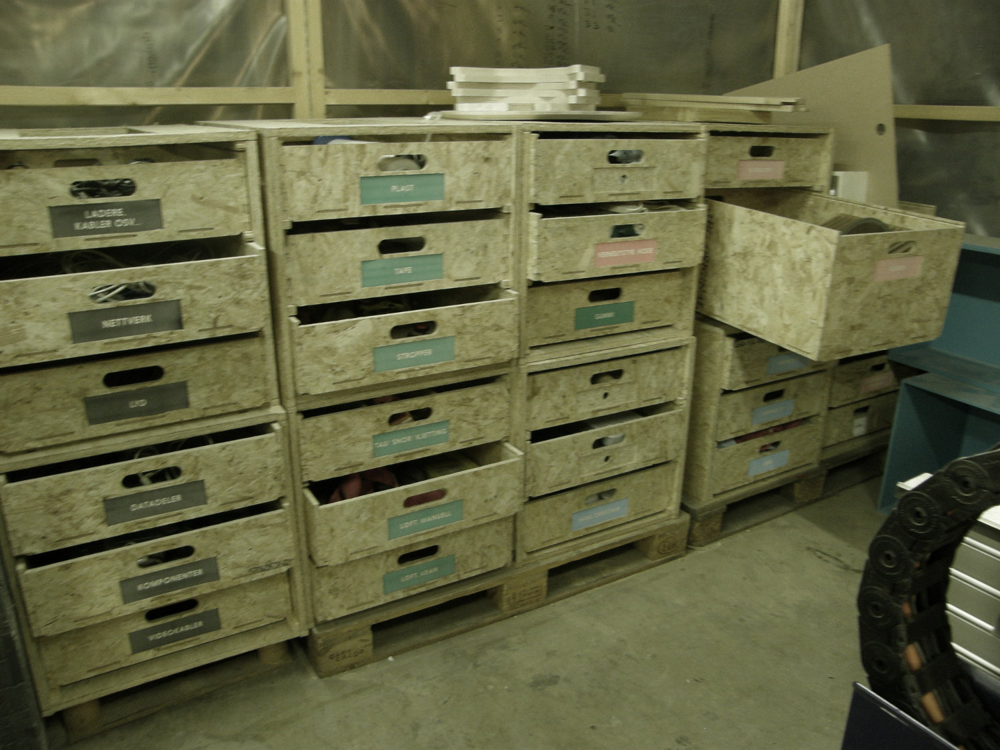
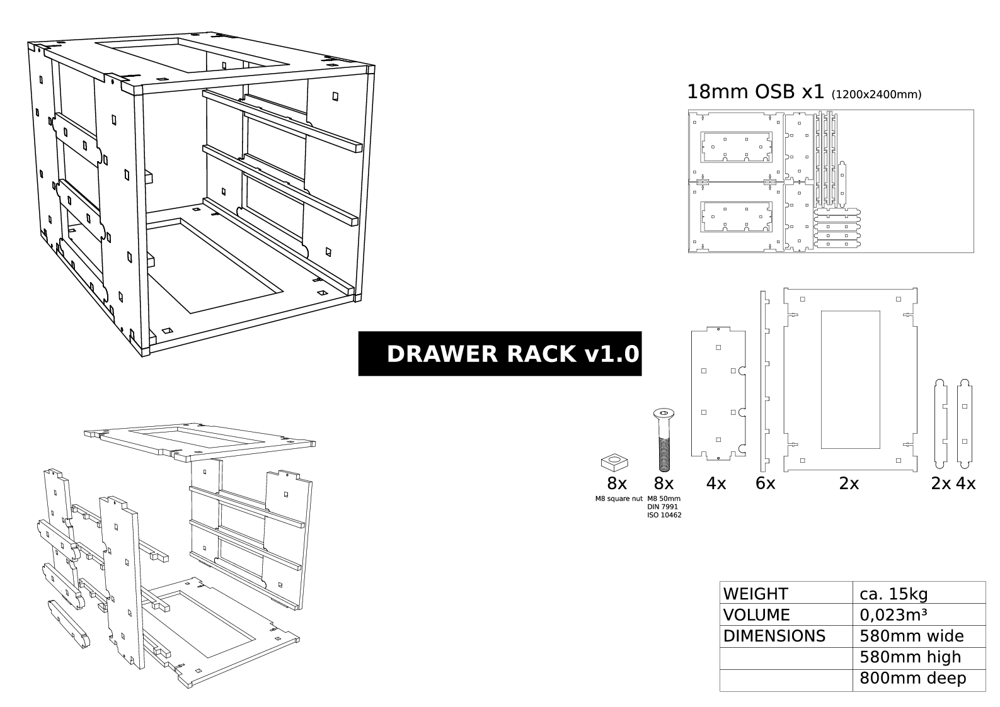
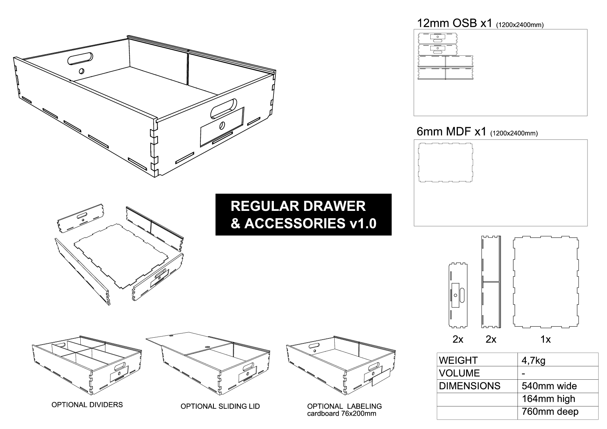
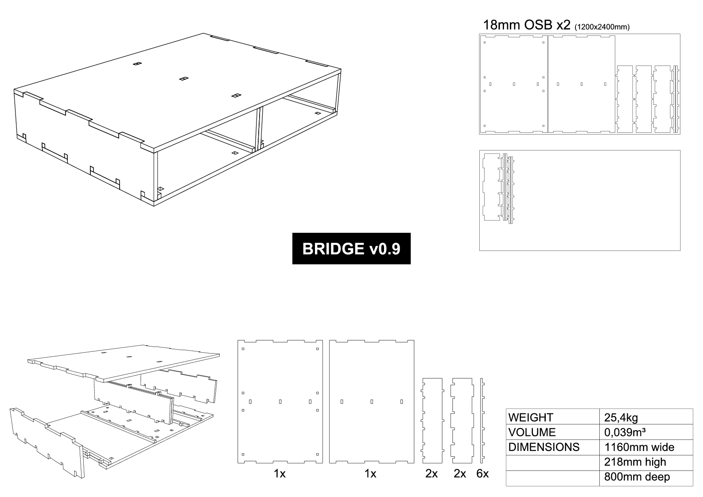

# Hat Systems
Hat Systems is a general purpose storage system for workshop storage of tools and inventory.

Designed with these basic principles in mind; modular, low-cost, heavy-duty/durable and spacious. The module sizes is designed to fit onto [EUR-palett](https://en.wikipedia.org/wiki/EUR-pallet), with a footprint size of 120x80 centimeter. This allows them to be moved around easily in an production or workshop environment, or even transported between locations.

Originally developed as for use in-house at [Fellesverkstedet](http://fellesverkstedet.no), now also in use at [Bitraf](http://bitraf.no), and open for reproduction across the world.

## License

Conceptualized for Fellesverkstedet by Hans Christian Skovholt and Graham A. Hayward, distributed under Creative Commons Attribution 4.0 International. [CC-BY 4.0](http://creativecommons.org/licenses/by/4.0/).

## Example configurations

### Storage shelves

Per palett: `2x2 Rack`, with  `3x Drawer Regular` in most of the racks.

## Prerequisites for making
You will need accesss to a large-scale CNC mill/router, capable of handling cutsheets of at least 60x80 cm (120x80 for current bridge design),
and cutting 18 mm [OSB](https://en.wikipedia.org/wiki/Oriented_strand_board).
Examples include the Shopbot PRS, or an extended Shapeoko/XCarve.

If you don't have access to such a machine, check out your local [FabLab](https://www.fablabs.io/map), makerspace or [hackerspace](https://wiki.hackerspaces.org/List_of_Hacker_Spaces)! Or find someone to manufacture it for you locally using [Fabhub.io directory](https://www.fabhub.io/directory).

Ready-to-use cutsheet geometry is included, but you will need to set up the toolpaths yourself using the CAM software for your machine.

## Modules

[Sketchup project source](./Hat_Systems_assembled.skp), for modifying or creating new modules.

### Rack

The base module, which drawers fit into.

Made of 18mm OSB.

Is put together with 8 countersunk socket head M8 x 50mm bolts and square nuts M8 x 13 x 5MM (DIN 7991/ISO 10462).
The countersunk bolts facilitates placing two units side by side on a pallett.

The rack is assembled with bolts in order to make it possible to dissasemble for transport. But could theoretically be glued or screwed together as well.

[.DXF original geometry](./Rack/RACK_full_sheet_v1.0_no_dogbones_no_hdd.dxf) | 
[Cutsheet .DXF (includes dogboones & holddown, for <=6mm tool)](./Rack/RACK_full_sheet_v1.0_6mm_dogbones.dxf) | 
[.STL 3d-model](./Rack.stl)

### Drawer Regular

Regular drawer that will fit most stuff.

Made of 12mm OSB, as well as 6mm MDF for drawer bottoms.

[.DXF original geometry](./Regular_drawer/DRAWERS_REGULAR_full_sheet_v1.0_no_dogbones_no_hdd.dxf) | 
[Cutsheet .DXF (includes dogboones & holddown, for <=6mm tool)](./Regular_drawer/DRAWERS_REGULAR_full_sheet_v1.0_6mm_dogbones.dxf) | 
[.STL 3d-model](./Drawer_regular.stl)

You will also need one drawer bottom.

[.DXF original geometry](./Drawer_bottom/DRAWER_BOTTOM_full_sheet_v1.0_no_dogbones_no_hdd.dxf) | 
[Cutsheet .DXF (includes dogboones & holddown, for <=6mm tool)](./Drawer_bottom/DRAWER_BOTTOM_full_sheet_v1.0_6mm_dogbones.dxf) | 

### Drawer BigOne

Supersized drawer, takes the place of two regular drawers in height. Otherwise identical to Drawer Regular.

[.DXF original geometry](./Big_One_drawer/BIG_ONE_Drawer_no_dogbones.dxf) | 
[Cutsheet .DXF (includes dogboones & holddown, for <=6mm tool)](./Big_One_drawer/BIG_ONE_Drawer_6mm_dogbones.dxf) | 
[.STL 3d-model](./Drawer_big_one.stl)

You will also need one drawer bottom, see above!

### Bridge

Forms a solid surface on top of two racks, as well as housing for two regular drawers.
Useful to create a working sturface, with height comfortable for standing work.

Original geometry [.DXF 1](./Big_One_drawer/Bridge/BRIDGE_v0.9_no_dogbones_1of2.dxf) [.DXF 2](./Big_One_drawer/Bridge/BRIDGE_v0.9_no_dogbones_2of2.dxf) | 

## TODO

* Material module is only partly documented, and files should be scrutinized before attemptin to produce. 
* Rack: Remove mostly-unused bolt holes in sides. They stay still by their own weight.
* Publish sources and assembly drawing for `Material Storage`
* Add a template .SVG file for drawer label (for ease of making on laser/printer)
